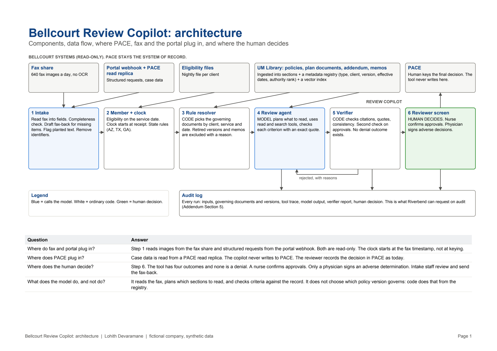
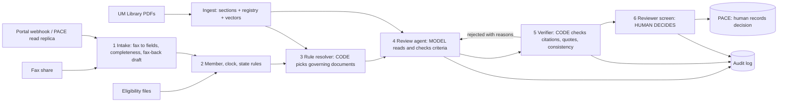

# Bellcourt Review Copilot

**Live demo:** https://bellcourt-review-copilot.vercel.app

Agentic RAG assistant for prior authorization review, built for the FDE Academy hackathon case *Bellcourt Health Administrators: Prior Authorization Under Pressure*.

> Bellcourt, Riverbend, every employer and every patient here are **fictional**. All data is synthetic.

## The problem, in three lines

1. **Reviewers apply the wrong rule.** 34% of 2026 denials cite a policy version that was already retired. 91% of those are overturned on appeal. QA accuracy is 56.7% against a 95% contract standard.
2. **The clock runs out at intake.** 66 of 69 late decisions arrived incomplete. Faxes wait 17 hours before anyone keys them.
3. **Nobody outside can see status.** 67% of calls ask "where is my request?".

Staffing is a strain, but it is not why deadlines are missed (details in `docs/Bellcourt_Case_Documentation.pdf`).

## What this does

For each request the copilot:

1. **Reads it**, including fax images nobody has keyed.
2. **Checks completeness at once** and drafts the fax back to the provider listing exactly what is missing.
3. **Confirms the member** and starts the clock from receipt.
4. **Selects the governing rules in code**: the client's plan document and amendments, the Riverbend addendum and Medicare rule, and the Bellcourt policy version in force on the date of service. Retired versions and memos are excluded, with the reason shown.
5. **Lets the model plan what to read**, then checks each criterion against the record with an exact quote.
6. **Verifies the answer in code** and runs a skeptical second check on every approval.
7. **Hands a recommendation to a person.** Four outcomes: approve-ready, need information, route to physician, route as not covered. There is no deny outcome. A nurse confirms approvals; a physician signs adverse decisions.

## Results

| Test | Result |
|---|---|
| 120 cases audited by Bellcourt's QA team | **Copilot 117 of 120 (97.5%)**. Original human decisions 68 of 120 (56.7%) |
| Wrongful approvals on those cases | 0 |
| Denials issued by the tool | 0 (not possible by design) |
| 30 open cases, 13 of them fax images | 29 of 30 against the answer key |
| Adversarial, incomplete and wrong inputs | 23 of 24. The one failure ended in manual review |
| Deterministic unit tests | 27 of 27 |

Full tables and honest limits: [`docs/EVIDENCE.md`](docs/EVIDENCE.md).

## Architecture





| File | Role |
|---|---|
| `copilot/core.py` | Deterministic core: registry, rule resolver, read and search tools, eligibility, clock, de-identification, verifier |
| `copilot/agent.py` | Prompts and the bounded agent loop (plan, read, review, verify, second check). Fax reading |
| `copilot/pipeline.py` | `run_case()`: ties the steps together and applies overrides the model cannot undo |
| `copilot/llm.py` | The only module that calls a model (OpenRouter or the Gemini API, standard library only) |
| `api/review.py`, `api/ask.py` | Vercel serverless functions: live review, and "ask the policy library" |
| `public/index.html` | Reviewer screen: worklist, case review, evidence, ask the library, try a request, audit log |
| `scripts/` | `ingest.py` builds the knowledge base, `run_open.py` and `run_eval.py` produce the evidence, `build_docs.py` builds the PDFs |
| `data/` | Knowledge base PDFs, sections, registry, vectors, open cases, eligibility, QA audit file |

## Run it locally (5 steps)

```bash
git clone <this repo> && cd bellcourt-review-copilot
cp .env.example .env            # add an OpenRouter or Gemini key (optional: the app works in replay mode without one)
python3 scripts/dev_server.py   # needs only Python 3.10+, no packages
# open http://localhost:8765
```

To re-run the evidence (needs a key and a few cents of credit):

```bash
python3 -m venv .venv && .venv/bin/pip install pdfplumber pytest reportlab pypdfium2 pypdf
.venv/bin/python -m pytest -q            # 27 deterministic tests, no key needed
.venv/bin/python scripts/ingest.py       # rebuild sections, registry and vectors from the PDFs
.venv/bin/python scripts/run_open.py     # 30 open cases
.venv/bin/python scripts/run_eval.py     # 120 audited cases + adversarial tests
.venv/bin/python scripts/build_docs.py   # regenerate the PDFs and EVIDENCE.md
```

## Deploy on Vercel

```bash
npm i -g vercel
vercel login
vercel --prod
```

That gives a working public URL in **replay mode** (saved results, no model calls, no cost). To turn on live mode, add one model key and redeploy.

Option A, OpenRouter (recommended, pay as you go):

```bash
vercel env add OPENROUTER_API_KEY production
vercel --prod
```

Option B, Google Gemini API directly:

```bash
vercel env add GEMINI_API_KEY production
vercel env add LLM_PROVIDER production     # type: gemini
vercel --prod
```

A free-tier Gemini key allows about 20 requests a day per model. One case review makes 3 to 5 calls, so a free key runs out after about 5 cases. Use a paid Gemini key or OpenRouter for a demo. With Gemini only, library search uses keyword ranking (the vector index was built with OpenRouter embeddings).

## Deliverables

| Deliverable | Where |
|---|---|
| Documentation (PDF, 8 pages max) | `docs/Bellcourt_Case_Documentation.pdf` |
| Architecture diagram | `docs/Architecture_Diagram.pdf`, `docs/architecture.png` |
| Implementation strategy (90 days) and one-page design note | `docs/Implementation_Strategy_and_Design_Note.pdf` |
| Working demo, README, setup | this repository |
| Evidence it works | `docs/EVIDENCE.md`, Evidence tab in the app |

## Compliance by design

- No tool may deny, delay or modify a request: the outcome type has no denial, the fax-back is a draft a person sends, and tests assert it.
- Audit: every run stores inputs, governing documents and versions, tool trace, output and verifier report.
- PHI: name, date of birth, phone, record number and member ID are removed before the review step.
- Provider text is untrusted: planted instructions are flagged, cannot be used as evidence, and do not change the outcome.
- Riverbend needs 60 days' written notice before live use; Arizona and Texas rules are raised as flags on the case.

## Limits

Prototype. Human decisions are stored in the browser, not a database. Results vary slightly between runs. Only 6 of 38 employer plan documents were in the data pack.
