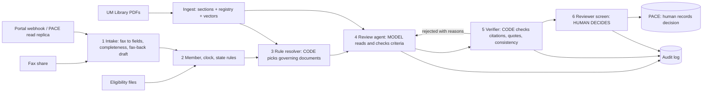

# Bellcourt Review Copilot

**Live demo:** https://bellcourt-review-copilot.vercel.app

Agentic RAG assistant for prior authorization review, built for the FDE Academy hackathon case *Bellcourt Health Administrators: Prior Authorization Under Pressure*.

> Bellcourt, Riverbend, every employer and every patient here are **fictional**. All data is synthetic.

## The problem, in three lines

1. **Reviewers apply the wrong rule.** 34% of 2026 denials cite a policy version that was already retired. 91% of those are overturned on appeal. QA accuracy is 56.7% against a 95% contract standard.
2. **The clock runs out at intake.** 66 of 69 late decisions arrived incomplete. Faxes wait 17 hours before anyone keys them.
3. **Nobody outside can see status.** 67% of calls ask "where is my request?".

Staffing is a strain, but it is not why deadlines are missed (details in `docs/Bellcourt_Case_Documentation.pdf`).

## What this does

A working prototype of the whole path from request to decision letter, with a screen for each person in the picture:

0. **Provider portal.** A provider office runs a **coverage check** before filing (eligibility, plan exclusions and conditions, the policy version whose criteria will apply, what to send; rules only, instant), submits the request by fax upload or form, gets a request number and receipt time at once, and follows status and written notices without a phone call. A **status desk** lets member-services agents look a request up for callers after the request number and the patient's date of birth both match.
1. **Raise a case** three ways: upload a fax image or PDF (read by a vision model), upload a case file (JSON or text), or fill the form (for phone requests). Intake coordinators and provider offices raise cases; reviewers do not.
2. **Intake check at once.** Missing fields are listed, the clock starts at receipt, and the case joins a priority queue: overdue, urgent, due soon, standard.
3. **Run the review.** Code confirms eligibility and selects the governing rules: the client's plan document and amendments, the Riverbend addendum and Medicare rule, and the Bellcourt policy version in force on the date of service. Retired versions and memos are excluded, with the reason shown. The model plans what to read and checks each criterion against the record with an exact quote. Code verifies the answer and runs a skeptical second check on every approval.
4. **See the analysis.** Recommendation and why, coverage checks, medical necessity criteria with pass or fail and the quoted evidence, and the reference documents. Each citation opens the source section, and the original policy PDF is one click away.
5. **A person decides.** Approve, pend for information, route to physician, or (physician only) deny. Differing from the recommendation needs a reason. There is no way for the tool to deny.
6. **Decision letter.** Created from the human decision: specific reason, provision relied on, appeal rights. Viewable, downloadable as PDF, and sent by email.
7. **Audit log.** Every create, review, decision, letter and status lookup, with user, role and time.
8. **Governance and security page.** Eleven live controls, each a button that runs the real code path and shows the server's answer: no deny outcome, role gate with a dry-run attempt, read-tool refusal of retired versions, de-identification, planted-text flagging, password hashing, token tampering, anonymous access, state rules, the receipt clock and the audit log.

## Results

| Test | Result |
|---|---|
| 120 cases audited by Bellcourt's QA team | **Copilot 117 of 120 (97.5%)**. Original human decisions 68 of 120 (56.7%) |
| Wrongful approvals on those cases | 0 |
| Denials issued by the tool | 0 (not possible by design) |
| 30 open cases, 13 of them fax images | 29 of 30 against the answer key |
| Adversarial, incomplete and wrong inputs | 23 of 24. The one failure ended in manual review |
| Deterministic unit tests | 41 of 41 |

Full tables and honest limits: [`docs/EVIDENCE.md`](docs/EVIDENCE.md).

## Architecture




| File | Role |
|---|---|
| `copilot/core.py` | Deterministic core: registry, rule resolver, read and search tools, eligibility, clock, de-identification, verifier |
| `copilot/agent.py` | Prompts and the bounded agent loop (plan, read, review, verify, second check). Fax reading |
| `copilot/pipeline.py` | `run_case()`: ties the steps together and applies overrides the model cannot undo |
| `copilot/llm.py` | The only module that calls a model (OpenRouter or the Gemini API, standard library only) |
| `copilot/auth.py` | Sign-in, signed sessions, roles |
| `copilot/cases.py` | Case lifecycle: create, review, human decision, letter, audit. Role rules, provider status views, status-desk lookup |
| `copilot/controls.py` | Live proofs for the Governance and security page |
| `copilot/letters.py` | Decision letter text, dependency-free PDF writer, Gmail delivery |
| `copilot/store.py` | Persistence: Supabase over REST, or a local file |
| `api/login.py`, `api/cases.py`, `api/data.py`, `api/review.py`, `api/ask.py` | Vercel serverless functions: sign-in, case workflow and letters, protected data and fax images, live review, "ask the policy library" |
| `public/index.html` | The workspace: sign-in, priority queue, new case, case review, coverage check, decision letters, policy library, governance and security, evidence, how it works, audit log; provider portal and status desk views by role |
| `scripts/` | `ingest.py` builds the knowledge base, `run_open.py` and `run_eval.py` produce the evidence, `build_docs.py` builds the PDFs, `build_deck.py` the presentation deck, `build_logo.py` the product mark |
| `data/` | Knowledge base PDFs, sections, registry, vectors, open cases, eligibility, QA audit file |

## How each kind of request is read

| Channel | What arrives | How the copilot reads it |
|---|---|---|
| Fax (46%) | An image on the fax share | A vision model transcribes the form into fields and detects blanks. The fax timestamp starts the clock |
| Portal (31%) | Structured fields through the portal webhook | No reading step. Straight to the completeness check |
| Phone (15%) | A call; the agent keys the request during the call | The agent uses the **New request** screen. The tool does not listen to calls or transcribe audio |
| Electronic (8%) | X12 278 transaction; PACE creates the case | Read from the PACE read replica as structured fields |

Every channel becomes the same case record and goes through the same six steps. If required fields are missing, a fax back to the provider is drafted in the first minute. At the end a person decides: a nurse confirms approvals, intake sends information requests, and only a physician can sign an adverse determination. The **How it works** tab in the app shows this.

## Sign-in and roles

The app requires sign-in. Six roles, enforced on the server for every request:

| Role | Raises requests | Runs the review | Decides | Sees |
|---|---|---|---|---|
| Provider office | Own patients, by form or fax upload | No | No | Status of own requests, notices, coverage check |
| Intake coordinator | Yes (fax share, phone, mail) | Yes | Pend, route | Full case |
| Nurse reviewer | No | Yes | Approve, pend, route | Full case |
| Physician reviewer | No | Yes | Approve, pend, deny | Full case |
| Member services agent | No | No | No | Status after verifying request number and date of birth; coverage check |
| Auditor | No | No | No | Everything, read only |

Reviewers do not raise cases: the person who decides must not create the record, so the receipt time and the request content stay independent of the reviewer. Passwords are stored only as salted PBKDF2 hashes in `copilot/users.json`. Sessions are HMAC-signed tokens that expire after 8 hours. Case data, fax images and both model endpoints are served only to signed-in users, and role limits are enforced on the server. Demo logins are shared with evaluators in the submission comment, not in this repository.

## Run it locally

```bash
git clone <this repo> && cd bellcourt-review-copilot
cp .env.example .env            # set AUTH_SECRET to any long random string; add an OpenRouter or Gemini key for live mode
python3 scripts/set_password.py nurse nurse "Your Name"     # create your own login
python3 scripts/dev_server.py   # needs only Python 3.10+, no packages
# open http://localhost:8765
```

To re-run the evidence (needs a key and a few cents of credit):

```bash
python3 -m venv .venv && .venv/bin/pip install pdfplumber pytest reportlab pypdfium2 pypdf
.venv/bin/python -m pytest -q            # 41 deterministic tests, no key needed
.venv/bin/python scripts/ingest.py       # rebuild sections, registry and vectors from the PDFs
.venv/bin/python scripts/run_open.py     # 30 open cases
.venv/bin/python scripts/run_eval.py     # 120 audited cases + adversarial tests
.venv/bin/python scripts/build_docs.py   # regenerate the PDFs, deck and EVIDENCE.md
```

## Deploy on Vercel

```bash
npm i -g vercel
vercel login
vercel --prod
```

Set the session-signing secret first (any long random string), then deploy:

```bash
vercel env add AUTH_SECRET production
vercel --prod
```

That gives a working public URL in **replay mode** (saved results, no model calls, no cost). To turn on live mode, add one model key and redeploy.

Option A, OpenRouter (recommended, pay as you go):

```bash
vercel env add OPENROUTER_API_KEY production
vercel --prod
```

Option B, Google Gemini API directly:

```bash
vercel env add GEMINI_API_KEY production
vercel env add LLM_PROVIDER production     # type: gemini
vercel --prod
```

Then connect the database and email: see [`docs/SETUP_DATABASE_AND_EMAIL.md`](docs/SETUP_DATABASE_AND_EMAIL.md). The app works without them, but new cases do not persist and letters cannot be emailed.

A free-tier Gemini key allows about 20 requests a day per model. One case review makes 3 to 5 calls, so a free key runs out after about 5 cases. Use a paid Gemini key or OpenRouter for a demo. With Gemini only, library search uses keyword ranking (the vector index was built with OpenRouter embeddings).

## Deliverables

| Deliverable | Where |
|---|---|
| Documentation (PDF, 8 pages max) | `docs/Bellcourt_Case_Documentation.pdf` |
| Architecture diagram | `docs/Architecture_Diagram.pdf`, `docs/architecture.png` |
| Implementation strategy (90 days) and one-page design note | `docs/Implementation_Strategy_and_Design_Note.pdf` |
| Working demo, README, setup | this repository |
| Evidence it works | `docs/EVIDENCE.md`, Evidence tab in the app |
| Presentation deck (10 slides, the evaluator's 8-minute flow) | `docs/Presentation_Deck.pdf` |
| Presentation playbook: talk track, demo steps, governance and evaluation proof steps, question bank | `docs/PRESENTATION_PLAYBOOK.md`, `docs/Presentation_Playbook.pdf` |
| Pitch deck (14 slides) | `docs/Pitch_Deck.pdf` |
| All of the above as one folder | `deliverables/` |
| Submission text | `docs/SUBMISSION.md` |
| Database and email setup | `docs/SETUP_DATABASE_AND_EMAIL.md` |

## Compliance by design

- No tool may deny, delay or modify a request: the outcome type has no denial, the fax-back is a draft a person sends, and tests assert it.
- Audit: every run stores inputs, governing documents and versions, tool trace, output and verifier report.
- PHI: name, date of birth, phone, record number and member ID are removed before the review step.
- Provider text is untrusted: planted instructions are flagged, cannot be used as evidence, and do not change the outcome.
- Riverbend needs 60 days' written notice before live use; Arizona and Texas rules are raised as flags on the case.

## Limits

Prototype. Without Supabase connected, new cases and decisions live in a temporary file. Sign-in is a small built-in service, not single sign-on. Demo letters go to one configured mailbox. Results vary slightly between runs. Only 6 of 38 employer plan documents were in the data pack.
